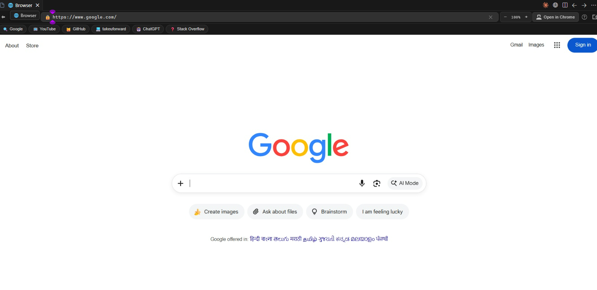
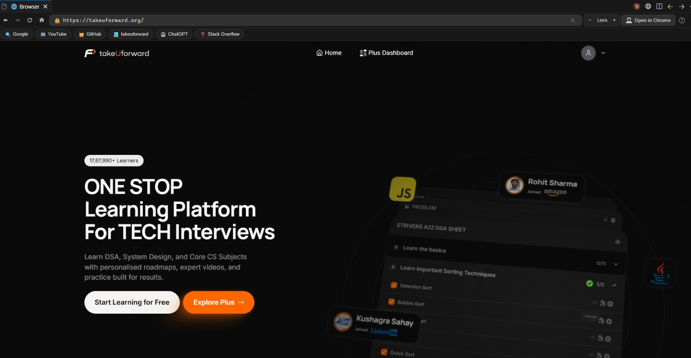
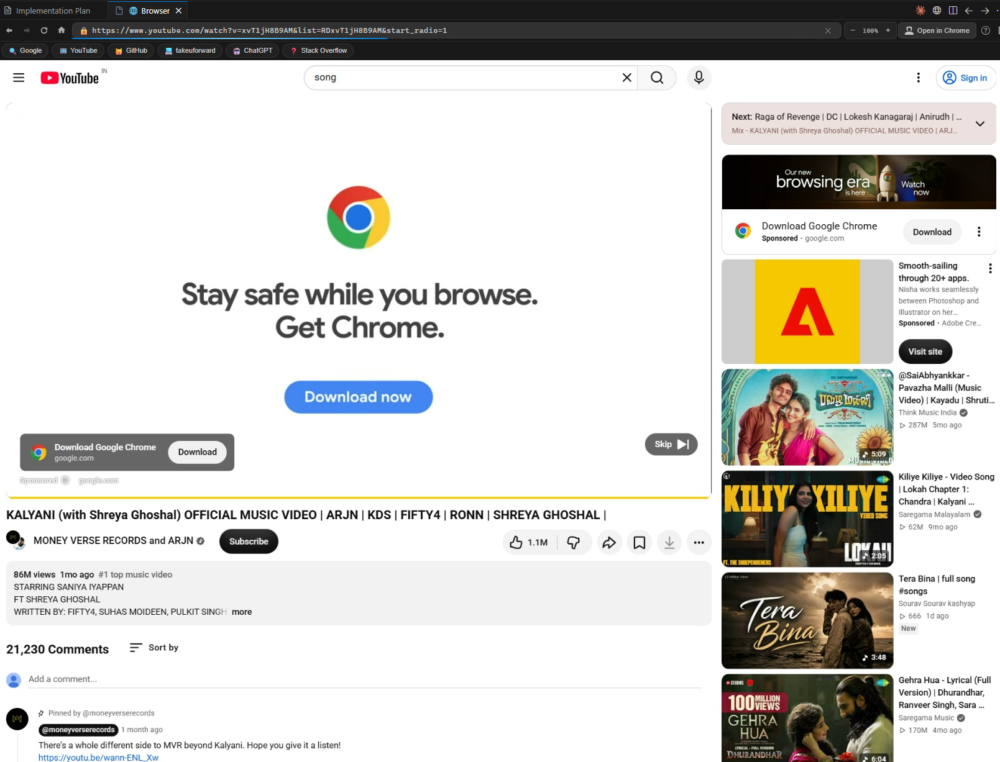

# ChromeX Browser

<p align="center">
  
</p>

<p align="center">
  
</p>

<p align="center">
  <strong>A complete, lightning-fast Web Browser embedded directly inside VS Code, Cursor, and Antigravity IDE.</strong><br/>
  Explore the internet, follow coding courses, stream video lectures with crystal-clear audio, search docs, and run interactive web apps side-by-side with your code — zero iframe or CSP limitations.
</p>

---

## 🌟 Why Use ChromeX Browser?

Stop switching back and forth between your IDE and external browser windows! 

Traditional VS Code browser extensions use simple `<iframe>` elements that fail on almost all modern websites due to `X-Frame-Options` and strict Content Security Policies.

**ChromeX Browser** launches a high-performance, GPU-accelerated **Chromium** engine in the background and streams low-latency, 60fps frames directly into your editor using the **Chrome DevTools Protocol (CDP)**. You get a genuine, unrestricted browser tab inside your editor.

---

## 📋 Prerequisites & System Requirements

Before using this extension, make sure you have at least one modern Chromium browser installed on your system:

| Browser | Support Status | Auto-Detected Paths |
|---|---|---|
| 🟢 **Google Chrome** *(Recommended)* | ✅ Full Support (Audio, DRM, GPU) | Windows, macOS, Linux standard install dirs |
| 🟢 **Microsoft Edge** | ✅ Full Support (Audio, DRM, GPU) | Windows standard install dirs |
| 🟢 **Brave Browser** | ✅ Full Support (Audio, GPU) | Windows standard install dirs |

> **Why is a local browser required?**  
> ChromeX Browser uses your local Chromium installation to deliver 100% native hardware acceleration, Widevine DRM playback for courses, low memory overhead, and direct system audio without relying on slow cloud proxies.

---

## 📦 Installation Guide

### Method 1: Install from Marketplace (Recommended)
1. Open **VS Code** / **Cursor** / **Antigravity IDE**.
2. Go to the Extensions view (`Ctrl + Shift + X` or `Cmd + Shift + X`).
3. Search for **`ChromeX Browser`**.
4. Click **Install**.

---

### Method 2: Install from `.vsix` Package
1. Download the `chromex-browser-1.0.0.vsix` file.
2. In VS Code, open the Command Palette (`Ctrl + Shift + P` or `Cmd + Shift + P`).
3. Type **`Extensions: Install from VSIX...`** and select the `.vsix` file.
4. *Or run via terminal:*
   ```bash
   code --install-extension chromex-browser-1.0.0.vsix
   ```

---

### 🔧 Custom Browser Path (If not auto-detected)
If your Chrome or Brave is installed in a custom location, specify the path in your VS Code settings:
1. Open Settings (`Ctrl + ,` or `Cmd + ,`).
2. Search for `fullBrowser.chromePath`.
3. Enter your executable path (e.g. `D:\Browsers\Chrome\chrome.exe`).

---

## 📸 Explore the Internet & Capabilities Showcase

### 1. 🎓 Learn & Code Simultaneously (DSA, Courses & Interactive Portals)
Watch coding video courses and follow problem-solving guides directly beside your code. Built-in Widevine CDM and GPU acceleration allow you to play protected lectures on platforms like TakeUForward, Coursera, Udemy, and LeetCode.



*Solve coding challenges, read editorials, and watch lecture videos without ever leaving your editor.*

---

### 2. 📺 Stream YouTube Tutorials, Tech Talks & Music
Stream developer tutorials, conference talks, or background music with native system audio, timeline scrubbing, seeking, and responsive fullscreen mode.



*Watch video walkthroughs with synced audio, keyboard playback controls, and fullscreen view.*

---

### 3. 🌐 Google Search, Official Docs & Web Apps
Search Google, browse MDN, read API documentation, look up Stack Overflow answers, or access web dashboards with instant keyboard typing and mouse interaction.


*Search the internet and access web tools with full typing precision and automatic theme matching.*

---

## ✨ Features at a Glance

| Feature | Description |
|---|---|
| 🌐 **Unrestricted Browsing** | Open any site (Google, YouTube, GitHub, ChatGPT, LeetCode, etc.) without iframe blocking |
| 🛡️ **DRM & Video Playback** | Widevine CDM auto-detection for protected educational videos & media |
| 🔊 **Native System Audio** | Full unmuted audio playback through your system speakers/headphones |
| ⚡ **Hardware Accelerated** | DirectX 11 ANGLE rendering, GPU rasterization, zero-copy video decode |
| ⌨️ **Precise Keyboard Input** | Single-keystroke accuracy, modifier keys (`Ctrl`, `Alt`, `Shift`), form navigation |
| 🖱️ **Full Mouse Interaction** | Exact coordinate mapping, drag-and-drop, text selection, wheel scrolling |
| 📐 **Dynamic Viewport Sync** | Automatically syncs Chrome viewport and window size on panel resize and fullscreen |
| 🍪 **Chrome Session Sync** | Import active login sessions and cookies from your local Chrome profile |
| 📑 **Quick Bookmarks Bar** | 1-click access to essentials (Google, YouTube, GitHub, TakeUForward, ChatGPT, Stack Overflow) |
| 🔍 **Zoom & Scaling** | In-browser zoom controls (`Ctrl + Plus`, `Ctrl + Minus`, `Ctrl + 0`) with live percentage display |
| 🎨 **IDE Theme Integration** | Automatically adapts to your editor's dark or light theme |
| 📊 **Real-time Diagnostics** | Live FPS counter, HTTPS security indicator, and quick help modal (`?`) |

---

## 🚀 How to Use

1. Press **`Ctrl + Shift + P`** (or **`Cmd + Shift + P`** on macOS) to open the Command Palette.
2. Type **`Open ChromeX Browser`** and hit **Enter** (or click the 🌐 icon in the Status Bar / Editor Title).
3. Type any URL or search term in the address bar and enjoy browsing!

---

## ⌨️ Keyboard Shortcuts (Inside Browser Panel)

| Shortcut | Action |
|---|---|
| `Ctrl + L` | Focus URL / Address Bar |
| `F5` | Reload current page |
| `Alt + Left` | Navigate Back |
| `Alt + Right` | Navigate Forward |
| `Ctrl + Plus` / `Ctrl + =` | Zoom In (+10%) |
| `Ctrl + Minus` | Zoom Out (-10%) |
| `Ctrl + 0` | Reset Zoom to 100% |
| `Escape` | Close modals / dialogs |
| `Enter` (in URL bar) | Navigate to URL |

---

## ⚙️ Extension Settings

Configure ChromeX Browser via **Settings (`Ctrl+,`) → Extensions → ChromeX Browser**:

| Setting | Default | Description |
|---|---|---|
| `fullBrowser.chromePath` | `""` *(auto-detect)* | Custom path to `chrome.exe`, `msedge.exe`, or `brave.exe` |
| `fullBrowser.homepage` | `https://www.google.com` | Default homepage URL on launch |
| `fullBrowser.quality` | `95` | Screencast JPEG quality (10–100) |
| `fullBrowser.everyNthFrame` | `1` | Capture rate (1 = smoothest 60 FPS) |
| `fullBrowser.profileMode` | `temporary` | Profile isolation mode (`temporary`, `persistent`, `chrome`) |
| `fullBrowser.profileDirectory` | `auto` | Chrome profile directory name |

---

## 🔒 Privacy & Security

- **100% Local**: Runs exclusively on your computer using your local browser installation.
- **No Cloud Proxies**: No data is sent to external servers or third parties.
- **Secure Isolation**: Your session cookies and credentials remain safe on your local drive.

---

*For developer build instructions, packaging commands, and architecture details, see [`DEVELOPER.md`](DEVELOPER.md).*
